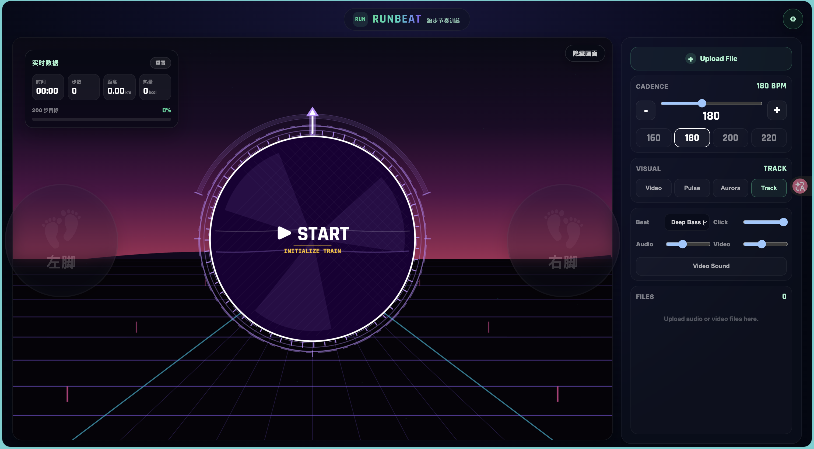
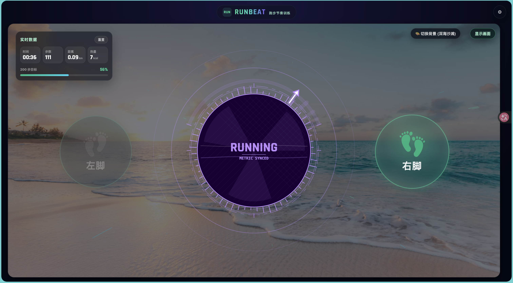

# RunBeat

跑步节奏训练 Web App：用可视化节拍、音乐同步和实时运动数据，帮你把步频练得更稳。



## 亮点

- BPM 节拍器：支持 100-300 BPM 调节和常用步频预设。
- 左右脚提示：随节拍交替高亮左脚/右脚，辅助稳定步频。
- 实时数据：记录步数、训练时长、距离和热量估算。
- 音色选择：内置 Deep Bass、808、Kick、Wood、Bell、Hi-Hat 等节拍音色。
- 自定义媒体：可导入音频或视频，自动估算 BPM，并按目标步频调整播放节奏。
- 视觉模式：内置 Pulse、Aurora、Track，也支持用视频作为训练背景。

## 截图

### 运行中状态



### 专注背景模式


## 本地运行

```bash
npm install
npm run dev
```

## 常用命令

```bash
npm run build
npm run lint
npm run preview
```

## 技术栈

React 19、TypeScript、Vite、Web Audio API。
